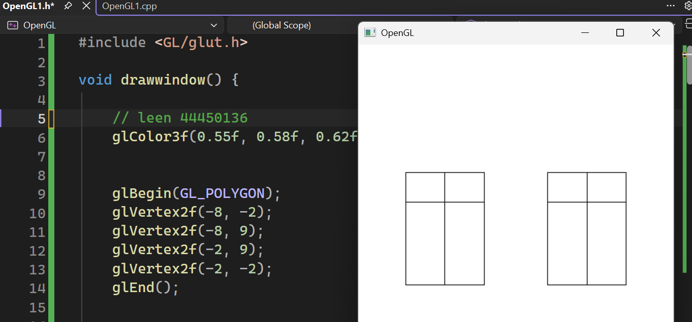

# Animated Café – OpenGL Project

This project was created for a Computer Graphics course using C++, OpenGL, and GLUT. The main goal is to design a complete 2D café scene and add movement to some elements to make the scene more interactive.

I started by drawing the café using basic shapes and coordinates, then worked on adding colours, details, and animation. This project helped me understand how programming can be used to create and animate visual scenes.

## Project Goals

* Design a complete 2D café scene
* Draw objects using shapes and coordinates
* Add colours and visual details
* Add movement and animation
* Apply computer graphics concepts in a practical project

## Technologies Used

* C++
* OpenGL
* GLUT
* Visual Studio

## Project Preview

